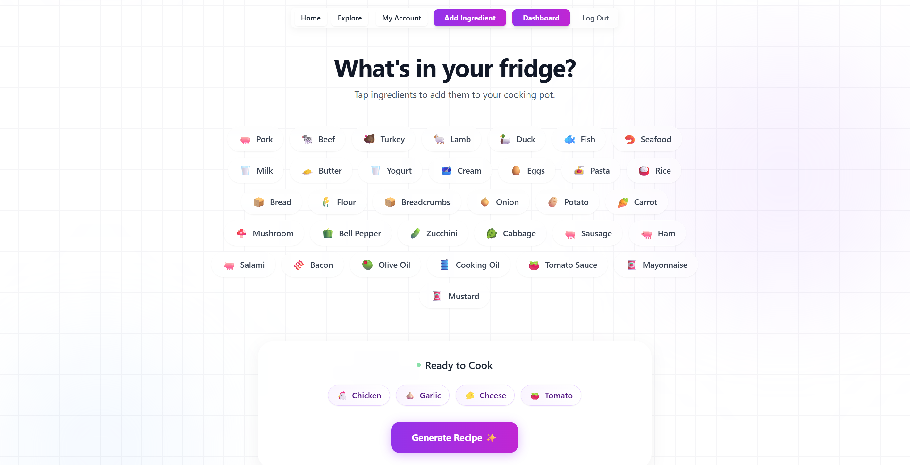

# Fridgy – Smart Kitchen Assistant

Fridgy is a full-stack web application that helps users manage their kitchen inventory and generate personalized recipes using OpenAI.

---

---

## Features

* **AI-Driven Recipe Generation**: Integration with OpenAI API to analyze available ingredients and generate high-quality, structured recipes.
* **Secure User Authentication**: Implementation of Spring Security with JWT (JSON Web Tokens) and custom decoding logic in the frontend for secure access.
* **Ingredient Suggestion System**: A unique workflow where users can suggest new ingredients (with custom names and symbols/emojis), which are then moderated by administrators.
* **Inventory Management**: Comprehensive CRUD functionality for tracking food items and managing personal digital fridges.
* **Role-Based Access Control**: Dedicated permissions for Users and Administrators (managed via Spring Security roles).
* **Live Admin Tools**: Capability for admins to approve or reject ingredient requests with personalized feedback messages.
* **Responsive User Interface**: A modern, fluid SPA built with React, Tailwind CSS, and Framer Motion for smooth animations.

---

## System Architecture

The application follows a decoupled MVC (Model-View-Controller) architecture to ensure scalability and a clean separation of concerns:

### Backend (Spring Boot)
* **RESTful API**: Built with Spring MVC to handle communication between the client and server.
* **Service Layer**: Contains core business logic and direct integration with the OpenAI API for recipe synthesis.
* **Security**: Implements Spring Security with JWT and BCrypt for secure, stateless authentication and role-based access control (USER/ADMIN).

### Frontend (React.js)
* **Component-Based UI**: Reusable components for a consistent design.
* **Styling & Animations**: Tailwind CSS and Framer Motion for a premium look and feel.
* **State Management**: Real-time updates using React Hooks (useState, useEffect, useMemo).

---

## Database Schema (MySQL)

The data layer is managed via Spring Data JPA with a relational MySQL structure. The `dfridgy` schema consists of the following interconnected tables:

* **users**: Stores encrypted user credentials and profile information.
* **ingredient**: A master list of available food items for selection.
* **recipe**: Stores generated recipes, including instructions and nutritional info.
* **recipe_ingredient**: A junction table managing the many-to-many relationship between recipes and their components.
* **review**: Stores user-submitted feedback and ratings for generated recipes.
* **ingredient_request**: A queue for user-proposed ingredients awaiting Admin approval.
* **user_favorite_recipes**: Tracks bookmarked content for individual user profiles.

---

## System Logic: How it Works

1. **Selection**: Users pick ingredients from the React interface.
2. **API Request**: Data is sent to the Spring Boot Controller via Fetch API.
3. **AI Integration**: The Service layer calls the OpenAI API to generate a recipe.
4. **Persistence**: Data is saved in MySQL, and the Admin Dashboard updates statistics.

---

